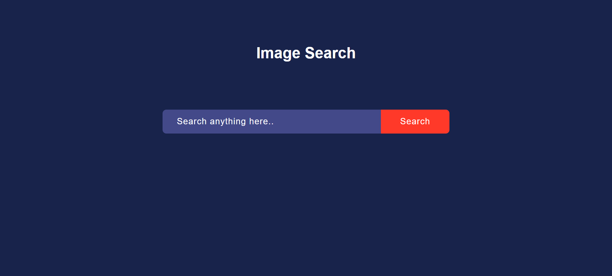
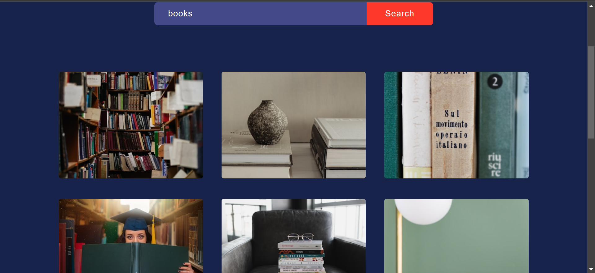
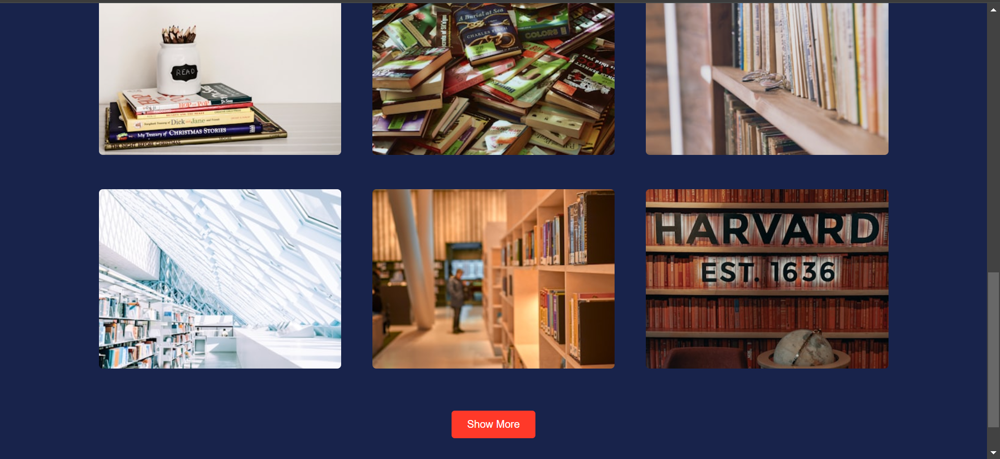
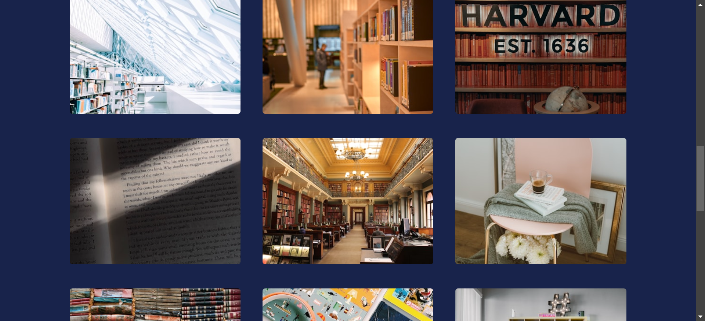

# ImageSearch

An image search application built using the HTML, CSS, JavaScript. This application allows users to search for images using keywords and displays the results in a user-friendly interface.

## Features

- Search for images using keywords
- Display search results with pagination
- Responsive design for mobile and desktop

## Technologies Used

- Frontend: HTML, CSS, Javascript 

## Screenshots

To provide a better understanding of the Recipe Book application, here is a screenshot:

##Main Interface

##Search Interface

##Show More Interface

Feel free to customize this template according to your project's specific needs and details!

For any inquiries, please contact:

Name: Gauranshi Varshney
Email: gauranshivarshney@gmail.com
